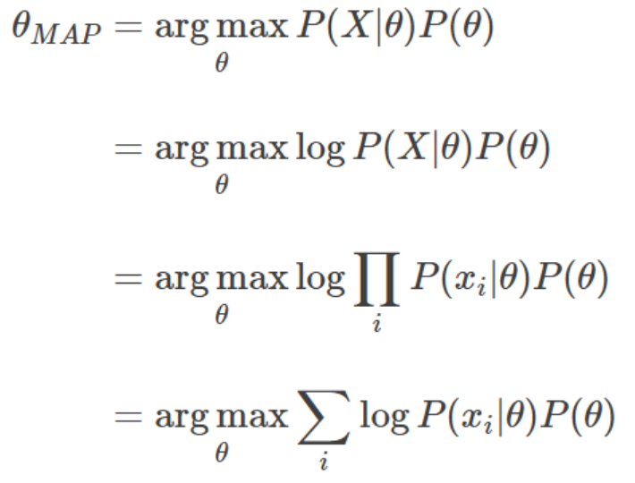
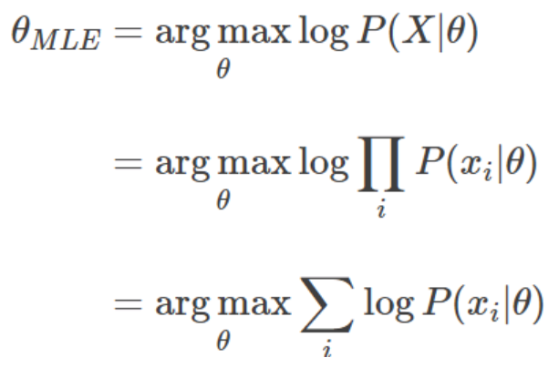

# Recommendation
  
estimating the ratings of each unobserverd entry in Y, which are used for ranking the items.

## Explicit Feedback vs Implicit Feedback
### Explicit Feedback
Netflix : star rating for movies   
Facebook : like/un-like   
Youtube : thumbs-up/down buttons   

There are a lot of cases that, explicit feedback do not exist.  
It makes hard to predict.  

### Implicit Feedback
reflect opinion through observing user behavior  
purchase history, browsing history, search patterns, or even mouse movements  

Implicit Feedback do not perfectly reflect preference.
e.g) buying present
  
## Similarity
### Cosine(x,y)
### Pearson Correlation Coefficient
### Spearman Rank

## MAP & MLE

## Past Approaches
### User-based CF
need Neighbor that is n users who are resemble with the user we want to predict  
[Herlocker, Jonathan L., et al. "An algorithmic framework for performing collaborative filtering." 22nd Annual International ACM SIGIR Conference on Research and Development in Information Retrieval, SIGIR 1999. Association for Computing Machinery, Inc, 1999.](https://experts.umn.edu/en/publications/an-algorithmic-framework-for-performing-collaborative-filtering)
### Item-based CF
just recommend the item resemble with selected

# Paper
## BPR : Bayesian Personalized Ranking from Implicit Feedback
## Matrix Factorization Techniques for Recommender Systems
Use p_i, q_j which are latent representations of users & items
Predict by 'dot of p_i, q_j'
  
## Neural Collaborative Filtering
Automatically learn the function F
## Deep Matrix Factorization Models for Recommender Systems
Use LFM (use inner product to calculate the interaction between users & items)  
Use representation learning (Deep Structured Semantic Models) instead of learning F.
