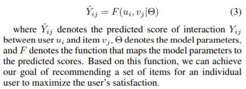

# Recommendation
  
estimating the ratings of each unobserverd entry in Y, which are used for ranking the items.

## Explicit Feedback vs Implicit Feedback
### Explicit Feedback
Netflix : star rating for movies   
Facebook : like/un-like   
Youtube : thumbs-up/down buttons   

There are a lot of cases that, explicit feedback do not exist.  
It makes hard to predict.  

### Implicit Feedback
reflect opinion through observing user behavior  
purchase history, browsing history, search patterns, or even mouse movements  

Implicit Feedback do not perfectly reflect preference.
e.g) buying present
  
## Similarity
### Cosine(x,y)
### Pearson Correlation Coefficient
### Spearman Rank

## MAP & MLE

## Loss Function
### Squared Loss
based on the assumption that observation are generated from a Gaussian distribution
### Cross-Entropy Loss
target value is a binary classification problem

## Past Approaches
### User-based CF
need Neighbor that is n users who are resemble with the user we want to predict  
[Herlocker, Jonathan L., et al. "An algorithmic framework for performing collaborative filtering." 22nd Annual International ACM SIGIR Conference on Research and Development in Information Retrieval, SIGIR 1999. Association for Computing Machinery, Inc, 1999.](https://experts.umn.edu/en/publications/an-algorithmic-framework-for-performing-collaborative-filtering)
### Item-based CF
just recommend the item resemble with selected

# Paper
## [Bayesian Personalized Ranking from Implicit Feedback (BPR)](https://arxiv.org/ftp/arxiv/papers/1205/1205.2618.pdf)  

## [Matrix Factorization Techniques for Recommender Systems (LFM)](https://datajobs.com/data-science-repo/Recommender-Systems-[Netflix].pdf)  
Use p_i, q_j which are latent representations of users & items
Predict by 'dot of p_i, q_j'
  
## Neural Collaborative Filtering (NCF)
Automatically learn the function F
## [Deep Matrix Factorization Models for Recommender Systems (DeepMF)](https://www.ijcai.org/proceedings/2017/0447.pdf)
Use LFM (use inner product to calculate the interaction between users & items)  
Use representation learning (Deep Structured Semantic Models) instead of learning F.

## [Group recommendation using feature space representing behavioral tendency and power balance among members (NCF)](https://dl.acm.org/citation.cfm?id=2043953)  

## Genarative Model for Group Recommendation (COM)  

## Attentive Group Recommendation (AGREE)
U : users {u_1, u_2, ... u_n} G : groups {g_1, g_2, ... g_s} V : items {v_1, v_2, ... v_m}  
Y : group-item interaction [y_ij]s x m  
M : user-item interaction [r_ij]n x m  

g_l(j) : predicted preference of the item j over group l (our goal)  
        1) User Embedding Aggregation + 2) Group Preference Embedding

By neural attention mechanism, learn the importance of different model components from data.  
Hence they calcualate the importance of a person in group.

1) User Embedding Aggregation  
특정 그룹(고정)내에서 t를 구매하는데에 j의 영향력을 구하고 그것들의 linear sum을 해당그룹이 t를 구매할 가능성으로 보았다.  
α(j,t) : a learnable parameter denoting the influence of member user u_t in deciding the group’s choice on item v_j  

2) Group Preference Embedding  
  

## [Attentional Factorization Machines: Learning the Weight of Feature Interactions via Attention Networks](https://arxiv.org/abs/1708.04617)  
Learn the importance of each feature interaction from data via a neural network.  
Purpose : Learn the importance of each feature interaction  
Common Solution1 : Augment a feature vector with product of features.(Poloynomial Regression : PR)  
Problem of CS1: In sparse dataset, only a few cross features are observed. So the parameters for unobserved cross features cannot be estimated.  
Common Solution2 : Learning an embedding vector for each feature, and estimate the weight for any cross feature (Factorization Matrix : FM)  
Problem of CS2 : May result in suboptimal prediction (local maxima)
Solution they suggest : Attentive Facorization Matrix
 

## Group Preference Based Bayesian Personalized Ranking for One-Class Collaborative Filtering (GBPR)
